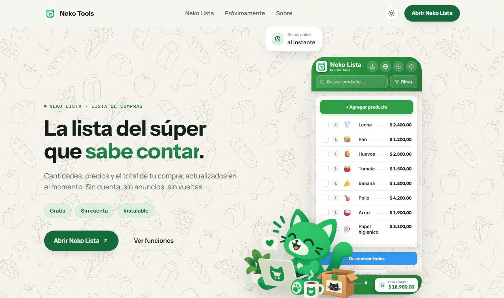
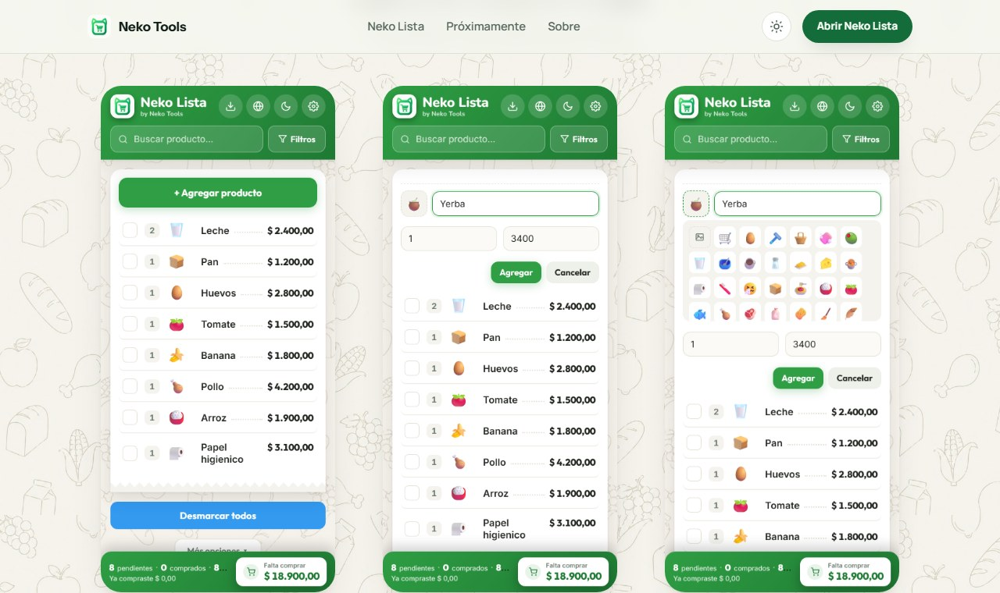
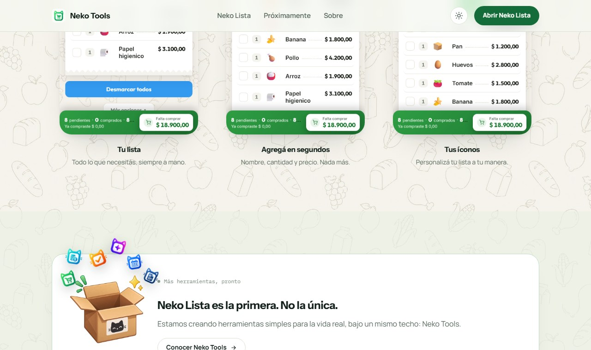
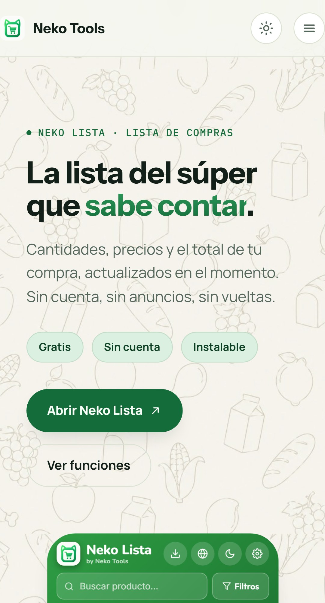

# Neko Tools

Landing page de [Neko Tools](https://nekotools.site): presenta Neko Lista, la primera herramienta de la marca, y adelanta las próximas.

### 🌐 [Ver sitio en vivo →](https://nekotools.site)

## 📸 Vista previa

Más capturas: galería de Neko Lista, sección "próximamente", versión mobile

## ✨ Detalles

- Contenido que aparece al hacer scroll (`IntersectionObserver`) y microinteracciones de hover en toda la página.
- Menú propio en mobile (hamburguesa con las secciones y el CTA), en vez de solo esconder los links.
- Caja "próximamente" interactiva: un tap o un hover la abre y muestra, en abanico, un adelanto animado de las próximas herramientas.
- Modo claro/oscuro y SEO técnico: `sitemap.xml`, `robots.txt`, datos estructurados JSON-LD, Open Graph y Twitter Card.

## 🛠️ Stack

Sitio estático: HTML, CSS y JavaScript vanilla, sin build ni frameworks. `index.html` es el único punto de entrada; `img/` tiene los assets reales (logo, marca y capturas de la app).

## 🚀 Deploy

Este repo se despliega por Git a Hostinger, apuntando al dominio `nekotools.site`. Cualquier push a `master` se refleja en el sitio.

## 👤 Autor

Desarrollado por [Marcos Martínez](https://github.com/MarcosJavMartinez), bajo la marca Neko Tools.
